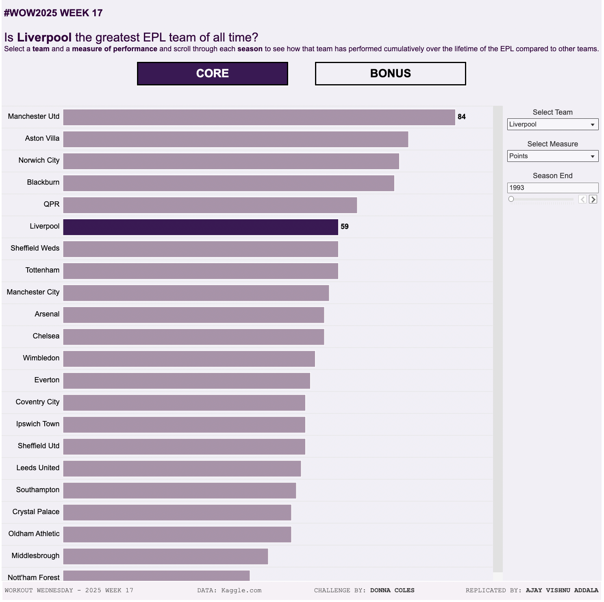

# Workout Wednesday 2025 | Week 17 | EPL Greatest Team Analysis

This Tableau dashboard explores the question of which team might be considered the greatest English Premier League (EPL) team of all time. Using historical data, the visualization allows users to interactively explore cumulative performance measures for teams over the seasons. The primary focus of this project is **measure switching**, a fundamental Tableau technique.

## 📊 Dashboard Features
- **Interactive Measure Switching**: Choose between four measures: Points, Goal Difference, Goals For, and Goals Against.
- **Highlight a Team**: Highlight a selected team's bar in a distinct color and show its position across seasons.
- **Season Scroller**: Manually scroll through seasons to visualize how team standings evolve over time.
- **Dynamic Sorting**: Sort bars dynamically based on the selected measure, prioritizing higher values (or lower for Goals Against).
- **Tooltip Details**: Display both the current season’s selected measure and the cumulative value in tooltips.
- **Conditional Display**: Show teams only when they have earned points in a season.

## 💡 Bonus Challenge
- **Centered Bar Chart**: Optionally display bars centered on a horizontal line, with minimal spacing for negative Goal Differences.

---

## 🎨 Design
- **Background**: Pale purple `#f1eff6`
- **Bars**: Mid-purple `#ac92aa`
- **Selected Team Highlight**: Dark purple `#3e1756`
- **Labeling**: Selected team and 1st place team bars are labeled for clarity.

---

## 📁 Dataset
The dataset includes measures for Points, Goal Difference, Goals For, and Goals Against across EPL seasons. Cumulative values are pre-calculated.

---

## 📸 Snapshot

---

## 🚀 Tableau Public Link
[Explore the Dashboard on Tableau Public](https://public.tableau.com/shared/WCGXMT2FN?:display_count=n&:origin=viz_share_link)

---

## 🛠️ Instructions for Use
1. **Measure Switching**: Use the dropdown menu to switch between Points, Goal Difference, Goals For, or Goals Against.
2. **Team Highlighting**: Select a team from the dropdown to highlight its bar and display detailed information.
3. **Season Scrolling**: Use the slider to scroll through seasons and observe how standings change dynamically.
4. **Sorting Logic**: Understand the sort order dynamically adjusts based on the selected measure.

---

## 🌟 Bonus Challenge Feature
For the bonus challenge, bars are displayed centrally on a horizontal line. Team names align centrally to the left-hand side, with minimal spacing for negative values in Goal Difference.

---

## 📖 References
This project is inspired by **Workout Wednesday 2025** | Week 17, curated by Donna Coles.
